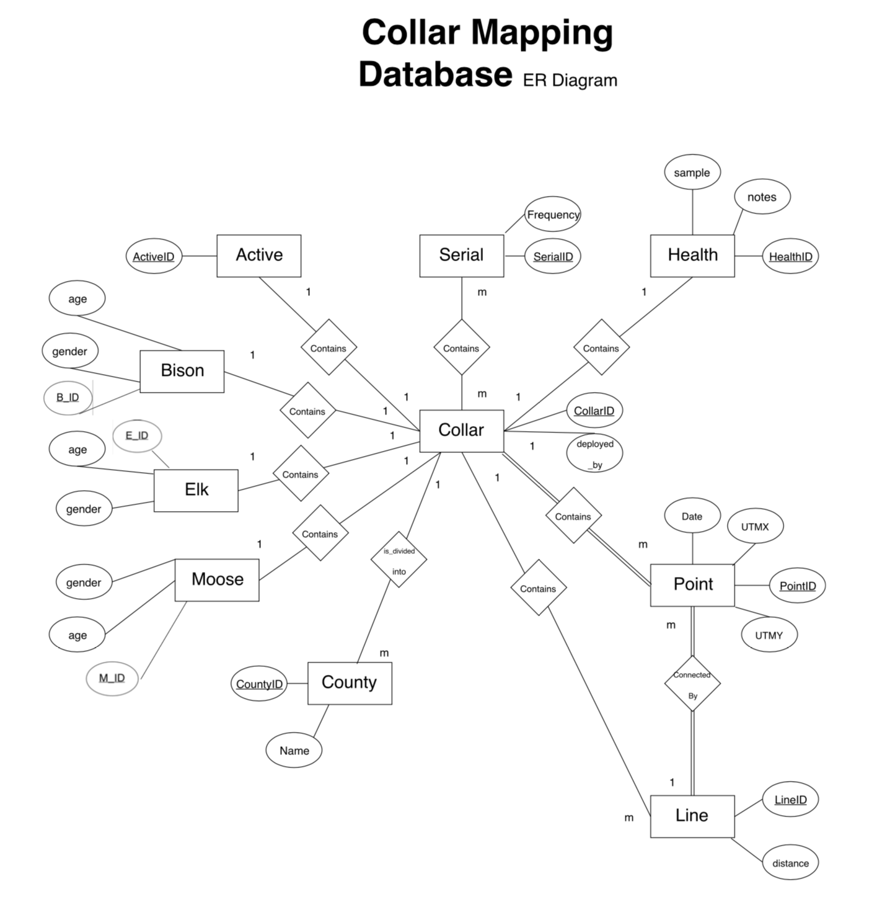
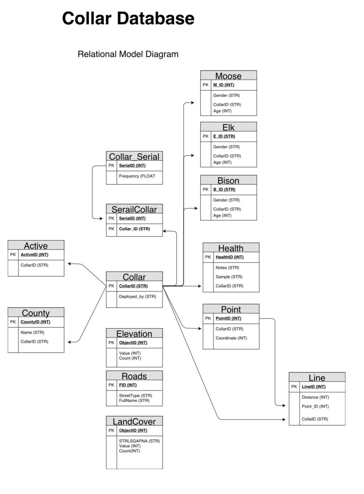

## SQL GPS Collar Database

<h3>The database that has been created addresses the increased use and deployment of GPS collars on various species
                at the Department of Wildlife Resources (DWR).

It was designed and planned out using an entity relationship model and a relational
                model. This laid the groundwork for how the database would function before it was built. The database is
                centered around a unique collar ID that is linked to various data such as health status, coordinates, and
                individual species.</h3>

## Built with:

- ArcMap Geodatabase
- Entity Relationship Model
- Relational Model

## Screenshots

<h2>Entity Relationship Model</h2>

<h2>Relational Model</h2>

<h2>Final Paper</h2>

[paper](screenshots/datapaper.pdf)

